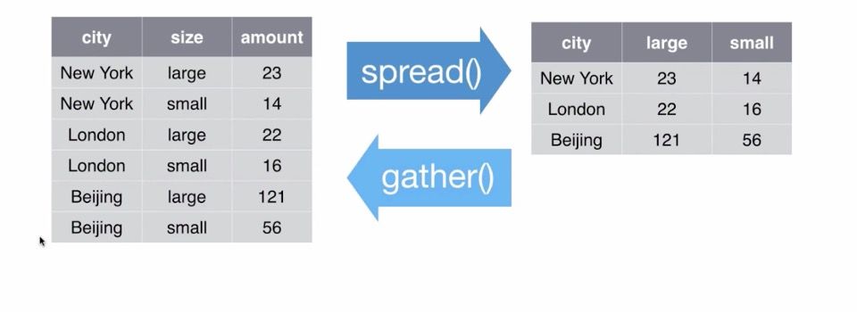

Adapted from [R for Data Science](http://r4ds.had.co.nz/) by Hadley Wichkam and Garrett Grolemund 

\

```{r}
library(tidyverse)
```

# Getting data into R! 

 *Maybe the most important step?*  
 
\  


##Base R 

* **read.csv()** is the function avaiable from base R, and maybe the one you are most familiar with  
    + This function reads data directly into a data frame so to use other packages (like dplyr) you will need to convert to a tibble yourself
    + You can specify if first columns of data are headers using header = TRUE  
```{r}
FAO1 <- read.csv("FAOSTAT_data.csv", header = TRUE)

```
\  


##readr
* **read_csv()** (from **readr** package) makes data from a .csv file right into a *tibble*  
    + up to 10x faster than **read.csv()**
    + reads in data directly as a tibble 
    + tibbles play better with your console window (pays attention to how wide your console window is) and is implemented through the dplyr package 

```{r }
library(tidyverse)

FAO1 <- read_csv("FAOSTAT_data.csv")
FAO1
```

#### Some tips for **read_csv()** 
  * Use skip = n to skip n nows if there are rows of metadata above your column headers. 
  * Use col_names = FALSE if there are no row headings or
  * col_names = c("x", "y", "z") to pass a vector of column names to the data table
  * use na = "." to specify what missing values look like  


Say that after import, you notice that you would like to change one of your variable types, you can do that by specifying the variable type for each column. For example, let's say we want to change year to character:
```{r}
FAO2 <- read_csv("FAOSTAT_data.csv", col_types = cols(
    Country = col_character(),
    Element = col_character(),
    Item = col_character(),
    Year = col_character(), ### changed year to character
    Unit = col_character(),
    Value = col_integer()
  ))
FAO2
```


### Read directly from excel files using the tidyverse package **readxl**  
* read_excel() detects file path 
*-* read_xlsx() reads directly from .xlsx file
```{r}
FAOxls <- readxl::read_excel("FAOSTAT_data2.xlsx")
FAOxls
```

### Read in other data types
- Read in SPSS, Stata and SAS files using package **haven**

\  

\  


# What is "tidy" data?  
Let's take a look at three data sets (more info at [this Rstudio webinar!](https://www.youtube.com/watch?v=y9KJmUGc8SE))

```{r, results='hide'}
#devtools::install_github("rstudio/EDAWR") 
library(EDAWR)
stormsA <- EDAWR::storms ## so it doesn't get confused with built-in NOAA weather data!
```
\  

#### Let's examine three built-in datasets:  
\  
First, 'cases':
```{r}
cases
```
Notice that each variable stored in its own cell:  

  * Country is in a column  
  * Year is in a row  

\  
Next, 'polution':
```{r}
pollution
```
In 'pollution', variables "amount of small particles" and "amount of large particles" are not in their own column. Therefore, doing math with them would be difficult!  
\  
Finally, 'stormsA':  
```{r}
stormsA
```
This format, where each variable is in it's own column, is much easier to work with!  

  * What if we want to make a ratio of pressure to wind?  

```{r}
stormsB <- (stormsA$pressure / stormsA$wind)
stormsB
```
\  
\  

# Tidyr

* Tidy data has each variable saved in it's own column &
* Each observation has a row &
* Each value in it's own cell!  
* this package is similar to Reshape2 (cast and melt)  
* Best practice to organize your data this way now, and avoid the pain of data cleaning later!

#### In the book (R for Data Science) there are three data table examples. Which one is "tidy"?


```{r}
table1
table2
table3
```

#### Only table 1!  
Notice that each column is a variable. 

```{r}
table1
```


### Graph your tidy data  
####Using the data in Table 1, you can easily graph!   


```{r}
library(ggplot2)
ggplot(table1, aes(year, cases)) +
  geom_line(aes(group = country), color = "gray30") +
  geom_point(aes(color = country)) +
  theme_minimal()
```

#### Or, using our tidy FAO data, we can see how much area of Cassava changed over time in each country

```{r}
FAO3 <- FAO2 %>% filter(Item == "Cassava")
library(ggplot2)
ggplot(FAO3, aes(Year, Value)) +
  geom_point(aes(color = Country)) +
  ylab("Area planted (ha)") +
  theme_minimal()
```

### Getting un-tidy data into shape  


Let's look at the "cases" dataset from earlier  
\  

### Spreading and Gathering  
\  


#### Gathering 

Let's 'gather' the 'cases' dataset!   

  * Function = *gather()*  
    + Key column  
    + Value column  
    + Names of columns to collapse

```{r}
cases
cases2 <- gather(cases, key = "year", value = "n", 2:4)
cases2
cases3 <- cases %>% gather(key = "year", value = "n", "2011", "2012", "2013")
```

#### Spreading  

Let's 'spread' the pollution dataset  
\  


```{r}
pollution
pollution2 <- spread(pollution, size, amount)
pollution2
```
\  


#### Recap (adapted from G. Gromland)
\  




\  


### Separating and uniting  
\  

#### separate() splits a column by a character string seperator   
  + Let's look at the storms data!  
  + Year, month and day are "hidden" variables

```{r}
stormsA
stormsC <- separate(stormsA, date, into = c("year", "month", "day"), sep = "-")
stormsC
```


#### Unite() does the inverse of seperate! 
  + Unites columns into a single variable
  
```{r}
stormsD <- stormsC %>% unite("date", year, month, day, sep = "-")
stormsD
```
